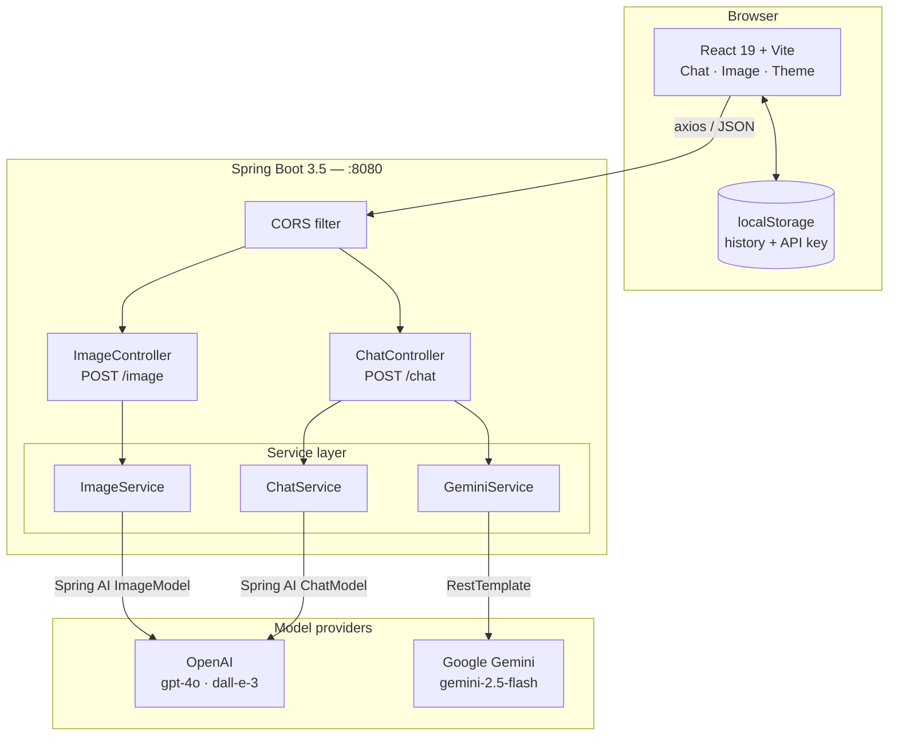
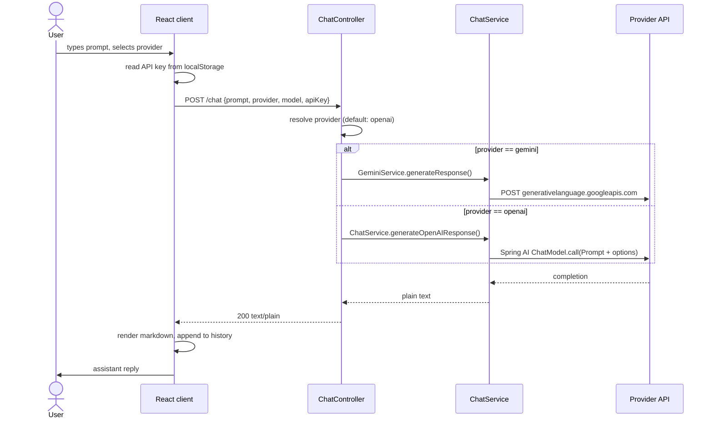
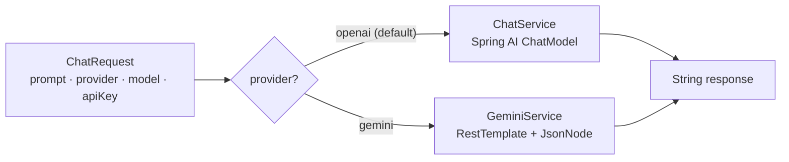

# AI Assistant Platform

A full-stack, multi-provider generative AI assistant built with **Java 21 / Spring Boot 3.5 / Spring AI** on the backend and **React 19 + Vite** on the frontend. Users bring their own API key, pick a provider (OpenAI or Google Gemini), and chat or generate images through a single unified backend abstraction.

The point of this project is not the chat UI — it is the **provider-agnostic AI service layer**. Adding a new model provider means implementing one interface and registering a bean; no controller, DTO, or frontend change is required.

---

## Table of contents

- [Architecture](#architecture)
- [Request lifecycle](#request-lifecycle)
- [Provider abstraction](#provider-abstraction)
- [Tech stack](#tech-stack)
- [Getting started](#getting-started)
- [Configuration](#configuration)
- [API reference](#api-reference)
- [Project structure](#project-structure)
- [Design decisions](#design-decisions)
- [Roadmap](#roadmap)
- [Credits](#credits)
- [License](#license)

---

## Architecture

Three layers, with the provider fan-out isolated behind the service tier.



## Request lifecycle

A chat turn, end to end. Note that the API key travels with each request and is never persisted server-side — the backend is fully stateless.



## Provider abstraction

Provider selection happens at request time, not startup. The OpenAI path rides Spring AI's `ChatModel` with per-request `OpenAiChatOptions`, so the caller's key is injected as an `Authorization` header instead of being baked into `application.properties`. The Gemini path uses a plain `RestTemplate` because Gemini takes the key as a query parameter.



## Tech stack

| Layer | Technology |
|---|---|
| Language | Java 21 |
| Framework | Spring Boot 3.5.7 (Spring Web MVC) |
| AI orchestration | Spring AI 1.0.3 (`spring-ai-starter-model-openai`) |
| Boilerplate reduction | Lombok |
| Chat models | OpenAI `gpt-4o`, Google `gemini-2.5-flash` |
| Image model | OpenAI DALL·E 3 |
| Frontend | React 19, Vite 7 |
| HTTP client | Axios |
| UI | `react-markdown` + `remark-gfm`, `react-icons`, `react-hot-toast` |
| Persistence | Browser `localStorage` (stateless backend) |
| Build | Maven Wrapper, npm |
| Container | Dockerfile (backend) |

## Getting started

### Prerequisites

- JDK 21+
- Node.js 18+
- An API key for OpenAI and/or Google AI Studio

### Backend

```bash
cd backend
./mvnw spring-boot:run
```

Serves on `http://localhost:8080`.

### Frontend

```bash
cd frontend
npm install
npm run dev
```

Serves on `http://localhost:5173`. Paste your API key into the in-app settings — it is stored in `localStorage` and sent per request.

### Docker (backend)

```bash
cd backend
docker build -t ai-assistant-api .
docker run -p 8080:8080 ai-assistant-api
```

## Configuration

`backend/src/main/resources/application.properties`:

```properties
spring.application.name=chatbot
spring.ai.openai.chat.options.model=gpt-4o
spring.ai.openai.api-key=${OPENAI_API_KEY:sk-placeholder}
```

Spring AI requires a non-empty key at bean-creation time even though the effective key arrives per request. Export a placeholder or a real key:

```bash
export OPENAI_API_KEY=sk-...
```

Allowed CORS origins are declared in `config/Config.java`. Add your deployed frontend origin there before shipping.

## API reference

### `POST /chat`

```json
{
  "prompt": "Summarize the risks in this quarter's roadmap",
  "provider": "openai",
  "model": "gpt-4o",
  "apiKey": "sk-..."
}
```

Returns `200` with the completion as plain text. `provider` accepts `openai` or `gemini` and defaults to `openai`.

### `POST /image`

```json
{
  "prompt": "isometric diagram of a microservice mesh",
  "apiKey": "sk-..."
}
```

Returns the generated image URL.

## Project structure

```
.
├── backend/
│   ├── src/main/java/com/chatbot/chatbot/
│   │   ├── ChatbotApplication.java
│   │   ├── config/Config.java            # CORS, RestTemplate, ObjectMapper beans
│   │   ├── controller/
│   │   │   ├── ChatController.java       # POST /chat  — provider routing
│   │   │   └── ImageController.java      # POST /image
│   │   ├── service/
│   │   │   ├── ChatService.java          # Spring AI ChatModel (OpenAI)
│   │   │   ├── GeminiService.java        # REST call to Gemini
│   │   │   └── ImageService.java         # DALL·E 3
│   │   └── model/                        # ChatRequest, ImageRequest DTOs
│   ├── src/main/resources/application.properties
│   ├── Dockerfile
│   └── pom.xml
└── frontend/
    ├── src/
    │   ├── App.jsx
    │   ├── components/                   # Chat, Image, CustomDropdown
    │   ├── contexts/ThemeContext.jsx     # light/dark
    │   └── utils/config.js               # API base URL
    ├── vite.config.js
    └── package.json
```

## Design decisions

**Bring-your-own-key, stateless backend.** No key is stored on the server and no session state is held, so the API scales horizontally with zero coordination and can be deployed to any free-tier container host. The trade-off is that the key transits the request body, which is acceptable over TLS for a demo but would be replaced by a server-side vault and per-user auth in production.

**Spring AI over raw HTTP for OpenAI, raw HTTP for Gemini.** Spring AI gives portable `ChatModel` / `ImageModel` abstractions and per-request options, which is what makes provider swapping cheap. Gemini's Spring AI starter was not adopted here in order to demonstrate the fallback pattern for providers with no first-class abstraction.

**No database.** Conversation history lives in `localStorage`, which keeps the deployment to a single container. See the roadmap for the persistence path.

## Roadmap

- [ ] Streaming responses via SSE / `ChatModel.stream()` instead of blocking calls
- [ ] Server-side conversation memory backed by PostgreSQL
- [ ] RAG over uploaded documents using pgvector + Spring AI `VectorStore`
- [ ] Tool calling so the assistant can query structured application data and propose actions
- [ ] Anthropic Claude provider via `spring-ai-starter-model-anthropic`
- [ ] Spring Security + JWT, with keys held server-side per user
- [ ] Integration tests against a mocked `ChatModel`
- [ ] GitHub Actions CI: build, test, containerize

## Credits

Originally forked from [shihabhasan0161/AI-Chatbot](https://github.com/shihabhasan0161/AI-Chatbot) (MIT). This fork adds the multi-provider service abstraction documentation, architecture diagrams, and the roadmap items listed above.

## License

MIT — see [LICENSE.md](LICENSE.md).
